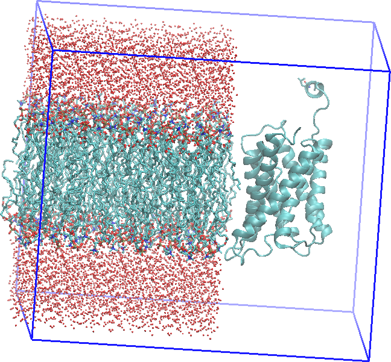
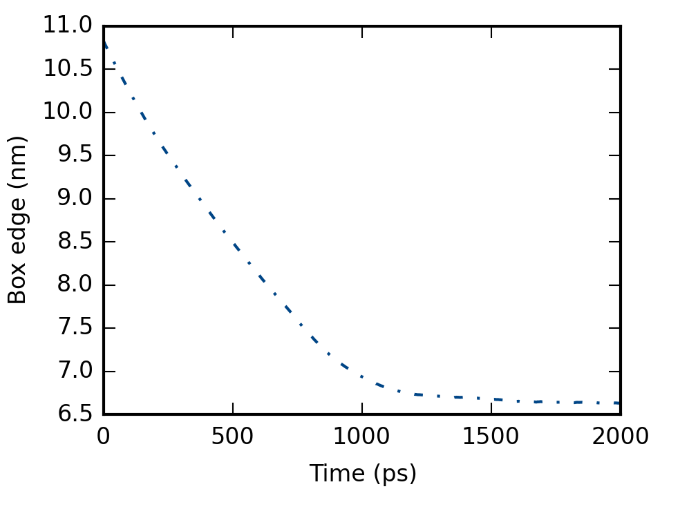
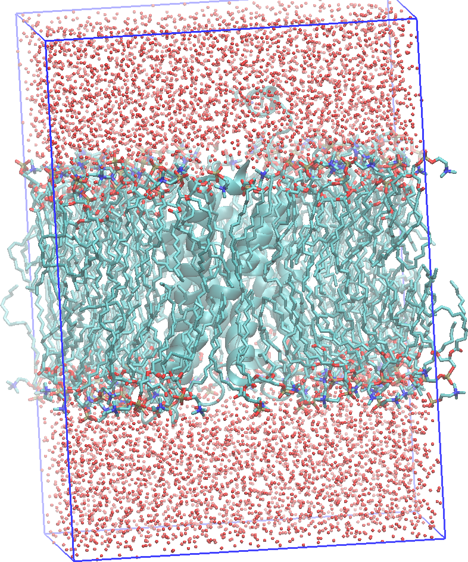

# Embedding a protein in a lipid bilayer with Gromacs

Setting up a protein in a box of water molecules is easy. Setting up a transmembrane protein in a lipid bilayer is slightly harder. And although, there a few tutorials out there detailing how it can be done, I don't find them entirely satisfying. Therefore, I here offer another tutorial.

The task: *embed the Aquaporin-2 (Aqp2) protein in a bilayer of POPC lipids*. The Aqp2 protein will be described with an Amber force field and the lipids with the Stockholm lipids (Slipids).

The MD program we will use is **Gromacs version 5.1**.

You will also need a range of in-house Python scripts that I have created and that you find in this Github repository: [Scripts](github.com/sgenheden/scripts). Download them to your local machine. I will be referring to this folder with `$SCRIPTS`.


The procedure to embed Aqp2 in a lipid bilayer is a three-stage affair:

1. First we will setup the protein
2. Second we will setup the bilayer
3. Third we will embed the protein in the bilayer

## Setting up the protein

The coordinate of the Aqp2 protein can be downloaded from the Protein databank (code 4NEF). However, it is better to download the coordinates from the [OPM database](http://opm.phar.umich.edu/), which has placed and oriented the protein in a hypothetical bilayer.

* Therefore, obtain the coordinates from [here](http://opm.phar.umich.edu/protein.php?search=4nef).

The protein is a homotetramer with four identical subunits. For the purpose of this tutorial it is sufficient to only simulate one of them.

* Therefore, open the `4nef.pdb` file in a text editor and remove all of the protein coordinates that is *not* in chain A, i.e. keep only the protein coordinates of chain A. Also remove the zinc atom and water molecule, they are not necessary for now.

* Save the new coordinates as `4nef_chainA.pdb`

> When you setup your own transmembrane protein, you should be more careful in the protein setup than we are in this tutorial. You should be careful to include ions and solvent molecules that could be important for protein function. You should also be careful on how you treat titratable sidechains, especially histidines.

Next, we will make a topology for the protein using Gromacs. This procedure will also add protons to the protein.

* Type the following command:

```
gmx pdb2gmx -f 4nef_chainA.pdb -o 4nef_gmx.gro -p 4nef.top -i 4nef_posres.itp -water tip3p -ff amber99sb-ildn
```

The last two options selects TIP3P as the water model and the Amber99SB-ILDN force field for the protein.

The `4nef_gmx.gro` file will contains the coordinates of the protonated protein, `4nef_posres.itp` contains positional restraints for the protein and `4nef.top` the protein topology. The topology specifies the atoms of the protein, their atom type and charge, together with bonded information (bonds, valance angles and torsions).

A Gromacs `.top` file also contains system information, i.e. what molecules the system consists of. It will also contain references to the protein, water and ion force fields that are located in the Gromacs installation directory. I personally perfer to separate the topologies from the system definition. I think it becomes cleaner in this way and one can re-use for instance a protein topology in many different systems. The protein topology can be stored in a Gromacs `.itp`file.

* Therefore, type:

```
cp 4nef.top 4nef.itp
```

* Open `4nef.itp` in a text editor. Remove the lines

```
; Include forcefield parameters
#include "amber99sb-ildn.ff/forcefield.itp"
```

at the beginning of the file *and* the following lines at the end of the file

```
; Include water topology
#include "amber99sb-ildn.ff/tip3p.itp"

#ifdef POSRES_WATER
; Position restraint for each water oxygen
[ position_restraints ]
;  i funct       fcx        fcy        fcz
    1    1       1000       1000       1000

; Include topology for ions
#include "amber99sb-ildn.ff/ions.itp"

[ system ]
; Name
AQUAPORIN-2; 6 DUCT WATER CHANNEL PROTEIN, WCH-CD, WATER CHANNEL PROTEIN FOR RENAL  ; 7 COLLECTING DUCT

[ molecules ]
; Compound        #mols
Protein_chain_A     1
```

Now we have a protein structure and a topology with a force field. Next step is to setup the bilayer.

## Setting up the bilayer

The task now is to create a bilayer of POPC lipids and TIP3P water molecules that we can embed the Aqp2 protein in. The trick is to know how many water and lipid molecules we need to fully cover the protein while also leaving sufficient room between the protein and the edges of the simulation box. This is not a trivial task and a possibly a little bit of trial-and-error is necessary.

A good starting point is to calculate the extent of the protein and then approximate it with a box.

* To calculate the extent, type :

```
python $SCRIPTS/Pdb/pdb_extent.py 4nef_chainA.pdb
```

which gives you output like

```
Mean: 13.216 13.980 0.792
Min:  -4.841 -16.737 -34.190
Max:  29.442 38.872 29.520
Len:  34.283 55.609 63.710
```

The bilayer plane will be in the xy-plane and the bilayer normal will be along the z-axis. Therefore, the height of the protein is approximately 65 Å and the maximum width (in the membrane plane) is approximately 55 Å.

The thickness of the water layer on each side of the bilayer is easiest to estimate: The height of the protein is 65 Å and therefore a box length (in z-dimension) of approximately 90 Å is good. The bilayer will be approximately 35 Å thick (based on a pure POPC bilayer). Therefore, we need a water thickness of (90 - 35) / 2 = 30 Å on each side.

 To estimate the number of lipids we will assume that the protein is a square and then place eight hypothetical boxes of lipids around it. We want a margin of at least 15 Å between the edges of the simulation box and the protein and therefore four of our hypothetical boxes will have a side of 15 Å. The other four will have sides of 15 and 55 Å. The total area will amount to (15 x 55) x 4 + (15 x 15) x 4 = 4200 Å^2. The area per lipid of POPC is approximately 65 Å^2, which means we can fit 4200 / 65 = 64 lipids around.

 > This will most likely be the very minimum. For your own application you should careful check that this produce a sufficient number of lipids.

To setup the membrane we will use the [CHARMM membrane builder](http://www.charmm-gui.org/?doc=input/membrane).

* Go to [http://www.charmm-gui.org/?doc=input/membrane](http://www.charmm-gui.org/?doc=input/membrane) and click on the `Membrane Only System` link.

* In the next page, do the following

    * Set the water thickness to 30 Å

    * Select *Length of XY based on* to `Numbers of lipid components`

    * Click on `PC` lipids and fill in 64 POPC lipids for both the upper and lower leaflet.

    * Click on the `Show the system info` button

    * Click on the `Next Step`-arrow


* Follow through the creation of the bilayer until **Step 5**. *Do not add ions to the bilayer*.

* Download the files `step5_assembly.pdb` and `step5_assembly.str`

Now we have created a bilayer that is of a fairly good quality. At least for the purpose of this tutorial. However, we need to add box information to the structure and do a short minimization.

* To add the box information, type

```gmx editconf -f step5_assembly.pdb -o step5_assembly.gro -box 6.6 6.6 9.4```

The box lengths are contained within the `step5_assembly.str` file or displayed on the CHARMM webpage.

To minimize it we need a topology and force field information for the lipids. Here, we will use the Stockholm lipids (Slipids) that can be downloaded from [here](http://www.fos.su.se/~sasha/SLipids/Downloads.html).

* From the homepage download `Slipids_ff.tar.gz` and unpack it on your local machine in the folder with all the tutorial files.

* Rename the folder to `slipid.ff`

* Also download `POPC.itp` and *place it* in the `slipid.ff` folder.

Now we need a system topology for the downloaded bilayer. Therefore,

* Open new file and called it `membrane.top` and in that file add the following content

```
#include "slipids.ff/forcefield.itp"
#include "slipids.ff/POPC.itp"
#include "slipids.ff/TIP3p.itp"

[ system ]
128 POPC + 7007

[ molecules ]
POPC    128
TIP3p  7007
```

If the CHARMM builder added more or less than 7007 water molecules, change that number in the `.top`-file.

Alltough the atom names in CHARMM and Slipid are identical, the order of the atoms are not. Also the residue name of the water molecules need to change. Therefore, type

* `sed -i "" "s/TIP3/SOL /" step5_assembly.gro`

to change the water residue names. And then,

* `python $SCRIPTS/Gromacs/gmx_reorder_atm.py -f step5_assembly.gro -p membrane.top -o membrane_initial.gro`

to re-order the atoms.

Now we can setup the minimization of the membrane:

* `gmx grompp -f em.mdp -c membrane_initial.gro -p membrane.top -o membrane_em.tpr`

and

* `gmx mdrun -deffnm membrane_em`

> Sometimes the quality of the structure from the CHARMM membrane builder is poor and some atoms overlap. In such a situation, the minimization will stop immediately because the energy is infinite. In that case, re-generate the membrane or try to move the affected atom 1 Å in any direction.  

Now we have a protein and a bilayer - time to put them together!

## Embed the protein

Now things start to be a little bit messier, as we have to merge the protein and lipid force fields.  

* First we will copy the non-bonded and bonded force field files for Amber99SB-ILDN from the Gromacs installation to our `slipid.ff` folder.

```
cp $GMX/share/gromacs/top/amber99sb-ildn.ff/ffnonbonded.itp slipids.ff/ffnonbonded-amber99sb-ildn.itp

cp $GMX/share/gromacs/top/amber99sb-ildn.ff/ffbonded.itp slipids.ff/ffbonded-amber99sb-ildn.itp
```

where `$GMX` is the installation path of Gromacs.

* Next, open `ffnonbonded-amber99sb-ildn.itp` in a text editor and remove the following lines (atom type definition):

```
HW           1       1.008   0.0000  A   0.00000e+00  0.00000e+00
Na          11      22.99    0.0000  A   3.32840e-01  1.15897e-02
OW           8      16.00    0.0000  A   3.15061e-01  6.36386e-01
```

These are already included in the *Slipid* version of the non-bonded file, so we don't want to repeat them.

Now we need to reference the Amber99SB-ILDN force field files in the Slipid files. Therefore.

* Open `slipid.ff/ffnonbonded.ff` in a text editor and add the following line to the end of it

```
#include "./ffnonbonded-amber99sb-ildn.itp"
```

* Open `slipid.ff/ffbonded.ff` in a text editor and add the following line to the end of it

```
#include "./ffbonded-amber99sb-ildn.itp"
```
Now we need to a `.top` file for the protein + bilayer system. You can create it from `membrane.top` if you want to. In any case call it `system.top` and it should contain the following

```
#include "slipids.ff/forcefield.itp"
#include "4nef.itp"
#include "slipids.ff/POPC.itp"
#include "slipids.ff/TIP3p.itp"


[ system ]
AQP2, 128 POPC + 7007

[ molecules ]
Protein_chain_A 1
POPC         128
TIP3p       7007
```

Now we come to the fun part of actually embedding the protein in the bilayer. To do this, we will follow a method proposed by Javanainen, which you can read about [here](http://pubs.acs.org/doi/abs/10.1021/ct500046e).

It will proceed in three stages:

1. Put the membrane and the protein in a common simulation box. The protein will be placed next to the membrane.

2. Apply high lateral pressure on the membrane, forcing it to embed the protein. To avoid deformation of the membrane and the proteins, restraints will be used.

3. Relax the membrane to a tensionless state, while still keeping the protein restrained.

### Putting the membrane and protein in a common box

The minimized coordinates of the membrane that we produced above is wrapped in the central simulation box, due to the periodic boundary conditions. This means that lipids and water molecules appear broken if you visualize them. Now, we are introducing a new simulation box, and therefore we need to make the molecules whole before putting it together with the protein.

* Run the following command

```
echo 0 | gmx trjconv -f membrane_em.gro -o membrane_em_whole.gro -s membrane_em.tpr -pbc whole
```

to unwrap the membrane. The `echo 0 |` part of the command automatically selected the system for output.

* Next, use an in-house script to place the protein next to the membrane

```
python $SCRIPTS/Membrane/place_protein.py -p 4nef_gmx.gro -m membrane_em_whole.gro -o initial.gro
```

this places the protein as close as possible to the membrane along the x-dimension. It also puts a new simulation box around the system.

>We can visualize it with for instance VMD
>
>`vmd initial.gro`
>
>and in the VMD terminal type
>
>`pbc box`
>
>to visualize the simulation box. It should look something like this.



### Simulation with high lateral pressure

Next step is to run a simulation with a high later pressure. That is we will have 1 atm in the z-dimension and 1000 atm in the xy-plane.

To avoid deformation of the protein, we will impose heavy restraints on all non-hydrogen atoms. Such restraints were already created (`4nef_posres.itp`) when we setup the topology with `pdb2gmx` but the magnitude of the restraints where only 1,000 kJ/mol/nm2 and here we need 10,000 kJ/mol/nm2.

* Therefore, type the following command

```
sed "s/1000  1000  1000/10000  10000  10000/g" 4nef_posres.itp > 4nef_pushres.itp
```

To create an `.itp`-file with the restraints.

* Then add the following lines to the end of `4nef.itp`

```
#ifdef PUSH
#include "4nef_pushres.itp"
#endif
```

We also need restraints on the lipids and the water. The restraints will only be in the z-dimension. For the lipids it is sufficient to add the restraints on an atom in the head group (here, we will add it on the N-atom) and on the carbons of the terminal methyl groups of the tails.

* Open `slipid.ff/POPC.itp` in a text editor and add the following lines to the end

```
#ifdef PUSH
[ position_restraints ]
; atom  type      fx      fy      fz
     1     1      0       0   10000
    88     1      0       0   10000
   131     1      0       0   10000
#endif
```

* Open `system.top` and add the following lines directly after the reference to the `TIP3p.itp`-file

```
#ifdef PUSH
; Position restraint for each water oxygen
[ position_restraints ]
;  i funct       fcx        fcy        fcz
   1    1          0        0         10000
#endif
```

as this will add to the definition of the water topology.

Now we can proceed with a short minimization:

* `gmx grompp -f em.mdp -c initial.gro -p system.top -o em.tpr`

and

* `gmx mdrun -deffnm em`

And then we can setup the "push"-simulation, with the high later pressure. For this we are using the `push.mdp` file provided.

A few lines in that file are worth commenting on:

```
define                   = -DPUSH
```

will active the restraints on the protein and the membrane. And

```
Pcoupltype               = semiisotropic
ref-p                    = 1000.013 1.013
```

will active the high lateral pressure.

The simulation will be 2 ns in length, typically the embedding is completed within 1.5 ns, with the coupling constant of the barostat set to 30 ps as specified in `push.mdp`

To setup the simulation, type

* `gmx grompp -f push.mdp -c em.gro -p system.top -o push.tpr -maxwarn 1 `

and then run the simulation, either on your local machine or on a cluster. The warning given by `gromppp` regarding the restraints can safely be ignored - if we follow the recommendation and get rid of the warning, the protein will not be embedded!


### Relaxing the membrane

Before, we proceed and relax the membrane. We can take a close look at the "push"-simulation.

First, we can plot the length of the box in the x-dimension.

* Type: `echo Box-X | gmx energy -f push.edr -o push_boxx.xvg`

to obtain the length of the box. Plotting it in your favorite plotting program should give you something like this



which shows you that the compression of the box was comleted after 1.5 ns.

If you visualize the system in for instance VMD and center the protein in the box. It should look something like this.



and you can clearly see the protein embedded in the membrane. If you don't center the protein, it will most likely be at the edge of the simulation box. This is of course also fine.

Now we can setup the relaxation simulation. Remember that the protein will still be restrained. But here we will use the restraints in the `4nef_posres.itp`-file, i.e. they will be slightly smaller in magnitude.

The simulation settings are found in the `relax.mdp`. You should study the differences between this file and `push.mdp`. The simulation will be 10 ns and there will be a few other differences, like we are coupling the protein, water and lipids to three different thermostats.

* Setup the simulation by typing:

```
gmx grompp -f relax.mdp -c push.gro -p system.top -o relax.tpr -maxwarn 1
```

and run the simulation preferably on a cluster as this will take a while on a local machine.

When this is done, you have an fairly well-equilibrated membrane around your protein. What to do next? Well, that depends on what you want to do!
