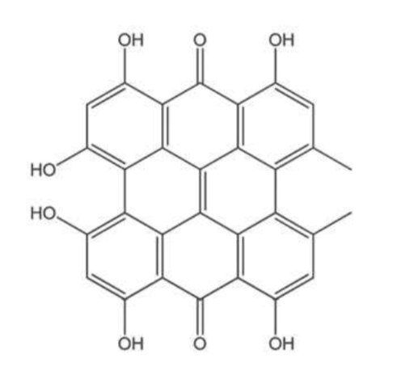
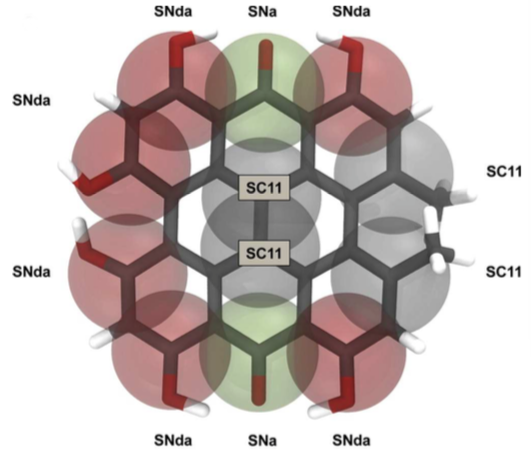
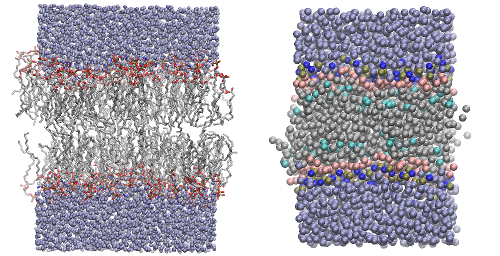
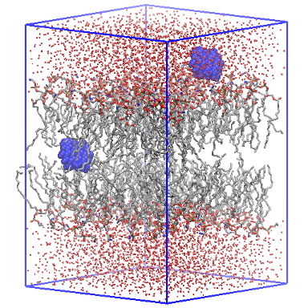
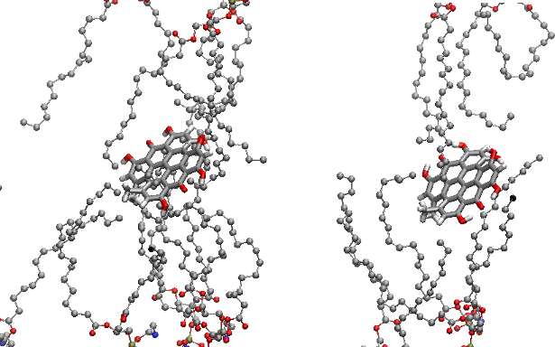
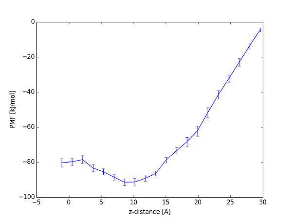
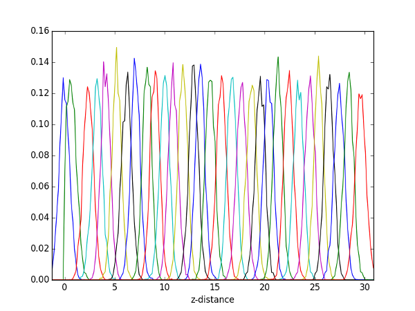

# Umbrella simulation of a small solute in a membrane using Gromacs

In this tutorial, I will show how I setup and run umbrella simulations of a small solutes in a membrane to estimate the potential of mean force (PMF) along the membrane normal. I will show how I do it with both an all-atom (Slipids+GAFF) and coarse-grained (Martini), as the procedure is very similar. I stress that this is _my_ approach, and not necessary the best or  most accurate method to estimate the PMF.

The MD program we will use is **Gromacs version 5.1** together with the plug-in **Plumed version 2.2**.

You will also need a range of in-house Python scripts that I have created and that you find in this Github repository: [Scripts](http://www.github.com/sgenheden/scripts). Download them to your local machine. I will be referring to this folder with `$SCRIPTS`.   

The procedure to compute the PMF is as follow:

1. Parametrize the small solute  
2. Create and equilibrate the membrane
3. Insert the solute at fixed positions in the membrane
4. Simulate the solute under the influence of an umbrella potential
5. Estimate the PMF using the WHAM (weighted histogram analysis method)

## Parametrize hypericin

In this tutorial we will compute the PMF of a drug called *hypericin* in a *POPE* membrane.

*Molecular structure of hypericin*

Here, I will assume that the hypericin molecule have been parametrized and that Gromacs topology/force field file (.itp) and structure (.gro) exists.


**They are provided with the tutorial in the `Aa` and `Cg` folders.  **

For the all-atom simulations, hypericin, has been parametrized with the GAFF force field and AM1-BCC charges. These files can for instance be obtained with the [ACPYPE](http://webapps.ccpn.ac.uk/acpype/) tool that is available online.

For the coarse-grained simulations, hypericin has been parametrized in manually in this [paper](http://dx.doi.org/10.1021/ct400466m). However, for reasonably small solutes, the CG parametrization can be carried out with the [auto_martini](https://github.com/tbereau/auto_martini) tool.

*Coarse-grained model of hypericin. Bead types are shown next to the beads*

## Create a pre-equilibrated membrane

To setup the membrane we will use the CHARMM online builder. It is available both for [all-atom](http://www.charmm-gui.org/?doc=input/membrane) and [coarse-grained](http://www.charmm-gui.org/?doc=input/mbilayer)

* Go to the builder for either AA and CG and click on the `Membrane Only System` link. For CG choose the *martini22* model.

* In the next page, do the following

    * If you are setting up all-atom, set the `hydration number` to 40. If you are setting up coarse-grained, set the `water thickness` to 30 Å

    * Select *Length of XY based on* to `Numbers of lipid components`

    * Click on `PE` lipids and fill in 64 POPE lipids for both the upper and lower leaflet.

    * Click on the `Show the system info` button

    * Click on the `Next Step`-arrow


* Follow through the creation of the bilayer until **Step 5**. *Do not add ions to the bilayer*.

* Download the files `step5_assembly.pdb` and `step5_assembly.str`

Now we have created a bilayer that is of a fairly good quality. At least for the purpose of this tutorial. However, we need to add box information to the structure and do a short minimization followed by an equilibration.

* To add the box information, type

```
bash $SCRIPTS/Membrane/builder2gro.bash step5_assembly
```

### Equilibrate the all-atom membrane

To minimize the membrane we need a topology and force field information for the lipids. Here, we will use the Stockholm lipids (Slipids) that can be downloaded from [here](http://www.fos.su.se/~sasha/SLipids/Downloads.html).

* From the homepage download `Slipids_ff.tar.gz` and unpack it on your local machine in the folder with all the tutorial files.

* Rename the folder to `slipids.ff`

* Also download `POPE.itp` and *place it* in the `slipid.ff` folder.

Now we need a system topology for the downloaded bilayer. Therefore,

* Open new file and call it `membrane.top` and in that file add the following content

```
#include "slipids.ff/forcefield.itp"
#include "slipids.ff/POPE.itp"
#include "slipids.ff/TIP3p.itp"

[ system ]
128 POPE + 5120 waters

[ molecules ]
POPE    128
TIP3p  5120
```

This is the topology for the system: 128 POPE lipids and 5120 water molecules. The topology links the necessary .itp-files and specifies the number of molecules of each kind.

Alltough the atom names in CHARMM and Slipid are identical, the order of the atoms are not. Also the residue name of the water molecules need to change. Therefore, type

* `sed -i "" "s/TIP3/SOL /" step5_assembly.gro`

to change the water residue names. And then,

* `python $SCRIPTS/Gromacs/gmx_reorder_atm.py -f step5_assembly.gro -p membrane.top -o membrane_initial.gro`

to re-order the atoms.

Now we can setup the minimization of the membrane:

* `gmx grompp -f em.mdp -c membrane_initial.gro -p membrane.top -o membrane_em.tpr`

and

* `gmx mdrun -deffnm membrane_em`

> Sometimes the quality of the structure from the CHARMM membrane builder is poor and some atoms overlap. In such a situation, the minimization will stop immediately because the energy is infinite. In that case, re-generate the membrane or try to move the affected atom 1 Å in any direction.  

To run a short (50 ns) equilibration, I have provided an .mdp-file

* `gmx grompp -f equil_mem.mdp -c membrane_em.gro -p membrane.top -o membrane_equil.tpr`

and

* `gmx mdrun -deffnm membrane_equil`


> If you have a later version of Gromacs, you can obtain warnings like **Right hand side '10.0 10.0' for parameter 'tau-p' in parameter file is not a real value**. The syntax of this parameter has changed in later versions, just remove the second 10.0.

### Equilibrate the coarse-grained membrane

To minimize the membrane we need a topology and force field information for the lipids and waters. The Martini force field can be downloaded from [here](http://cgmartini.nl/index.php/downloads).

* Download the `martini_v2.2.itp` file under *Force field parameters/Particle definitions*

* Download the `martini_v2.0_POPE_02.itp` file under *Force field parameters/Lipids*

Place both of the files in the `CG` folder.

Now we need a system topology for the downloaded bilayer. Therefore,

* Open new file and call it `membrane.top` and in that file add the following content

```
#include "martini_v2.2.itp"
#include "martini_v2.0_POPE_02.itp"

[ system ]
128 POPE + 1433 waters

[ molecules ]
POPE    128
W      1433
```

This is the topology for the system: 128 POPE lipids and 1433 water beads. The topology links the necessary .itp-files and specifies the number of molecules of each kind.

If the CHARMM builder added more or less than 1433 water beads, change that number in the `.top`-file.

Now we can setup the minimization of the membrane:

* `gmx grompp -f em_cg.mdp -c step5_assembly.gro -p membrane.top -o membrane_em.tpr`

and

* `gmx mdrun -deffnm membrane_em`

To run a short (50 ns) equilibration, I have provided an .mdp-file

* `gmx grompp -f equil_mem_cg.mdp -c membrane_em.gro -p membrane.top -o membrane_equil.tpr`

and

* `gmx mdrun -deffnm membrane_equil`

> If you have a later version of Gromacs, you can obtain warnings like **Right hand side '10.0 10.0' for parameter 'tau-p' in parameter file is not a real value**. The syntax of this parameter has changed in later versions, just remove the second 10.0.

---

Now we have a pre-equilibrated membrane of sufficient quality for our purposes. For your own research you should probably check that the pure membrane reproduces some essential physicochemical property such as area per lipid or thickness.


*The equilibrated membranes will look something like this*

## Insert the solute in the membrane

Now we have a small solute and a pre-equilibrated membrane and it is time to put them together. This is a two-stage procedure.

First, we will place the solute at fixed positions along the membrane normal (z-axis). Two solutes will be inserted on opposite sides of the membrane. The solute coordinates will overlap with the membrane coordinates.

Second, we will slowly grow the solute from a fully decoupled state to a fully interacting state. This is the most smooth approach to insert the solute in the membrane.

### Place hypericin in the membrane


First we will place the hypericin molecules in the pre-equilibrated membrane. Type,

* `
python $SCRIPTS/Membrane/insert_in_membrane.py -f hypericin.pdb -b membrane_equil.gro -z {0..30} -o inserted
`

and the script will place hypericin at positions that it will print to the screen.

The `-z {0..30}` option implies that we are inserting the solute at distances 0 to 30 Å from the membrane center. If you have a thicker membrane, you might want to insert it further out in the water phase. For a pure membrane, 30 Å is probably ok.

The structures are named `inserted_z0.gro`,  `inserted_z1.gro` etc.

For all-atom, one of the placed structures could like this.



Before we proceed to setup the actual MD simulation, we need to create the appropriate topology files. This procedure differ between all-atom and coarse-grained.

### Prepare the all-atom topology files

* Open new file and call it `system.top` and in that file add the following content

```
#include "slipids.ff/forcefield.itp"
#include "slipids.ff/POPE.itp"
#include "slipids.ff/TIP3p.itp"
#include "hypericin.itp"

#ifdef fixed
[ position_restraints ]
  15  1  1000  1000  1000 ; C6
  40  1  1000  1000  1000 ; C13   
  13  1  1000  1000  1000 ; C16
  42  1  1000  1000  1000 ; C27
#endif

[ system ]
128 POPE + 5120 waters + 2 hypericin

[ molecules ]
POPE    128
TIP3p  5120
hyp       2
```
This is the topology for the system: 128 POPE lipids, 5120 water molecules and 2 hypericin solutes. The topology links the necessary .itp-files and specifies the number of molecules of each kind.

However, the section starting with `#ifdef fixed` warrants an explanation. In the simulation when we are "growing" the solute from a decoupled to an interacting state we need to fix the position of the solute, otherwise it will be free to explore the simulation box when it is decoupled. Here, I have choosen to restrain four of the central carbon atoms in hypericin (C6, C13, C16 and C27). This should be sufficient to keep it in place.

* Next, we need to add the definition of the hypericin atom types to the Slipid force field. Therefore, open `slipids.ff/ffnonboned.itp` and add the following lines under the `[ atomtypes ]` section.

```
oh             8   16.00000    0.000000  A      0.306647      0.880314
ho             1    1.00800    0.000000  A             0             0
ca             6   12.01000    0.000000  A      0.339967      0.359824
c              6   12.01000    0.000000  A      0.339967      0.359824
o              8   16.00000    0.000000  A      0.295992       0.87864
ha             1    1.00800    0.000000  A      0.259964       0.06276
c3             6   12.01000    0.000000  A      0.339967       0.45773
hc             1    1.00800    0.000000  A      0.264953     0.0656888
```

These are standard GAFF atom types for the atoms in hypericin. In your own research, the atom types will most likely be different. If you are using tools like ACPYPE, they will be generated for you. They are typically put at the top of the solute .itp-file and you can then cut from there and paste them in the `ffnonbonded.itp` file.

### Prepare the coarse-grained topology files

* Open new file and call it `system.top` and in that file add the following content

```
#include "martini_v2.2.itp"
#include "martini_v2.0_POPE_02.itp"
#include "hypericin_cg_2.0.itp"

#ifdef fixed
[ position_restraints ]
  4  1  10000  10000  10000 ; R3
 12  1  10000  10000  10000 ; R11
#endif

[ system ]
128 POPE + 1433 waters + 2 hypericin

[ molecules ]
POPE    128
TIP3p  1433
hyp       2
```
This is the topology for the system: 128 POPE lipids, 1433 water beads and 2 hypericin solutes. The topology links the necessary .itp-files and specifies the number of molecules of each kind.

However, the section starting with `#ifdef fixed` warrants an explanation. In the simulation when we are "growing" the solute from a decoupled to an interacting state we need to fix the position of the solute, otherwise it will be free to explore the simulation box when it is decoupled. Here, I have choosen to restrain two of the central beads in hypericin (R3 and R11). This should be sufficient to keep it in place.

* Next, we need to add a special hypericin bead type to the force field definition. Open `martini_v2.2.itp` in a text editor and add the following line to the `[ atomtypes ]` section

```
SC11 72.0 0.000 A 0.0 0.0
```
* Also add the following lines to the ` [ nonbond_params ]` section:

```
SC11    SC11    1       6.64E-02        0.41957E-03 ; 75intermediate, s=0.43
P5      SC11    1       8.62E-02        0.92953E-03 ; repulsive
SP5     SC11    1       3.79E-02        0.23976E-03 ; 75repulsive, s=0.43
P4      SC11    1       4.54E-01        0.25810E-01 ; super repulsive, s=0.62
SP4     SC11    1       3.79E-02        0.23976E-03 ; 75repulsive, s=0.43
P3      SC11    1       9.92E-02        0.10690E-02 ; almost repulsive
SP3     SC11    1       4.36E-02        0.27572E-03 ; 75almost repulsive, s=0.43
P2      SC11    1       9.92E-02        0.10690E-02 ; almost repulsive
SP2     SC11    1       4.36E-02        0.27572E-03 ; 75almost repulsive, s=0.43
P1      SC11    1       1.16E-01        0.12549E-02 ; semi repulsive
SP1     SC11    1       5.12E-02        0.32367E-03 ; 75semi repulsive s=0.43
Nda     SC11    1       1.16E-01        0.12549E-02 ; semi repulsive
SNda    SC11    1       5.12E-02        0.32367E-03 ; 75semi repulsive s=0.43
Nd      SC11    1       1.16E-01        0.12549E-02 ; semi repulsive
SNd     SC11    1       5.12E-02        0.32367E-03 ; 75semi repulsive s=0.43
Na      SC11    1       8.62E-02        0.92953E-03 ; repulsive
SNa     SC11    1       5.12E-02        0.32367E-03 ; 75semi repulsive s=0.43
N0      SC11    1       1.16E-01        0.12549E-02 ; semi repulsive
SN0     SC11    1       5.12E-02        0.32367E-03 ; 75semi repulsive s=0.43
C5      SC11    1       1.34E-01        0.14408E-02 ; almost intermediate
SC5     SC11    1       5.88E-02        0.37162E-03 ; 75almost intermediate, s=0.43
C4      SC11    1       1.34E-01        0.14408E-02 ; almost intermediate
SC4     SC11    1       5.88E-02        0.37162E-03 ; 75almost intermediate, s=0.43
C3      SC11    1       8.53E-02        0.53946E-03 ; 75almost attractive, s=0.43
SC3     SC11    1       6.64E-02        0.41957E-03 ; 75intermediate, s=0.43
C2      SC11    1       1.51E-01        0.16267E-02 ; intermediate
SC2     SC11    1       6.64E-02        0.41957E-03 ; 75intermediate, s=0.43
SC11    Qda     1       4.54E-01        0.25810E-01 ; super repulsive, s=0.62
SC11    SQda    1       4.54E-01        0.25810E-01 ; super repulsive, s=0.62
SC11    Qd      1       4.54E-01        0.25810E-01 ; super repulsive, s=0.62
SC11    SQd     1       4.54E-01        0.25810E-01 ; super repulsive, s=0.62
SC11    Qa      1       4.54E-01        0.25810E-01 ; super repulsive, s=0.62
SC11    SQa     1       4.54E-01        0.25810E-01 ; super repulsive, s=0.62
SC11    Q0      1       4.54E-01        0.25810E-01 ; super repulsive, s=0.62
SC11    SQ0     1       4.54E-01        0.25810E-01 ; super repulsive, s=0.62
C1      SC11    1       8.53E-02        0.53946E-03 ; 75almost attractive, s=0.43
```

These steps are special for hypericin and typically not necssary if you use to standard bead types and automatically create the coarse-grained model with `auto_martini`.

### Insert hypericin in the membrane

Now we will create the run-file for Gromacs (.tpr-files).

* We need to create an index file for the system. Type `gmx make_ndx -f inserted_z0.gro`

* Rename the protein group (group 6 or 4) to `solute` using the command `name 6 solute`. For some reason, Gromacs thinks that hypericin is a protein residue, so it has creates all sorts of protein-related groups. For your own research, you have to create your solute group in another way.

* Type `q` to quit the program and save the index file to `index.ndx`

* Open `index.ndx` in text editor and manually copy the **solute** group in two new groups: One for each the two copies of hypericin. Name them `solute1` and `solute2`. It can look something like this (for coarse-grained)

```
[ solute ]
2970 2971 2972 2973 2974 2975 2976 2977 2978 2979 2980 2981 2982 2983 2984
2985 2986 2987 2988 2989 2990 2991 2992 2993
[ solute1 ]
2970 2971 2972 2973 2974 2975 2976 2977 2978 2979 2980 2981  
[ solute2 ]
2982 2983 2984 2985 2986 2987 2988 2989 2990 2991 2992 2993
```

Now we can setup the MD. For one of the structures, type


* `
gmx grompp -f grow.mdp -c inserted_z0.gro -p system.top -n index.ndx -o grow_z0.tpr  -maxwarn 3
`

Two things in the `grow.mdp` file is worth pointing out
1. The line `define                   = -Dfixed` turns the position restraints of hypericin on, fixing it at the appropriate positions.
2. The lines
```
free-energy              = yes
init-lambda              = 0.0
delta-lambda             = 4e-7
sc-alpha                 = 0.5
sc-coul                  = yes
sc-power                 = 1
couple-moltype           = hyp
couple-lambda0           = none
couple-lambda1           = vdw-q
couple-intramol          = no
nstdhdl                  = 0
```
turns on the free-energy code that we will use to grow the solute from a decoupled state to an interacting state. It will take 5 ns, which is set with the `delta-lambda` and `nsteps` options. Therefore, they are different for all-atom and coarse-grained simulations. For the other settings, please consult the Gromacs manual.

To setup all of the .tpr-file you can use a bash-loop.

```
for Z in {0..30}
do
gmx grompp -f grow.mdp -c inserted_z${Z}.gro -p system.top -n index.ndx -o grow_z${Z}.tpr  -maxwarn 3
done
```

The simulations are best run on a cluster.

The end results compared to the initial structure will look something like this


*Left) The structure after just placing hypericin in the membrane, Right) The structure after the "grow"-simulation*

## Umbrella sampling and WHAM

In the final stage, we proceed with the umbrella sampling simulations. We will use the *plumed* plug-in to apply the umbrella potential. Therefore, the setting in the .mdp-file is pretty mundane, just vanilla MD. 50 ns simulation nothing more.

To create the .tpr-files, type

```
for Z in {0..30}
do
gmx grompp -f sim.mdp -c grow_z${Z}.gro -p system.top -n index.ndx -o umb_z${Z}.tpr
done
```


Next, we need to create the input for *plumed*. We will create a small file that defines center of mass of some atoms and then define the distance between the solute and the membrane as the reaction coordinate. This file will then be used in all the umbrella simulations.

Therefore, type

* `
python $SCRIPTS/Membrane/make_plumed.py -s solute1 solute2 -m POPE > plumed-common.dat
`

The content of `plumed-common.dat` will look something like this

```
c1: COM ATOMS=2970-2981
c2: COM ATOMS=2982-2993
c3: COM ATOMS=1-1536

cv1: DISTANCE ATOMS=c1,c3 COMPONENTS
cv2: DISTANCE ATOMS=c2,c3 COMPONENTS
```

The first two lines defines the center of mass of the two solutes and the third line defines the COM of the membrane. The two last line define the distances between the two solutes and the membrane. For a closer explanation of the syntax, please consult the Plumed manual.

To create, the necessary input for the individual umbrella windows, type the following

```
for Z in {0..30}
do
Z2=`echo "3.0-${Z}.0*0.1"|bc`
Z1=`echo "${Z}.0*0.1"|bc`
cat << EOF > plumed_z${Z}.dat
INCLUDE FILE=plumed-common.dat
rest1: RESTRAINT ARG=cv1.z KAPPA=1000 AT=${Z1}
rest2: RESTRAINT ARG=cv2.z KAPPA=1000 AT=${Z2}
PRINT STRIDE=5000 ARG=cv1.z,cv2.z FILE=colvar_z${Z}.dat
EOF
done
```

First, we define two distances for the umbrella window in nanometers. Second, we create the Plumed input which links `plumed-common.dat` and then sets up two harmonic restraints of 1000 kJ/mol/nm2. The final line prints out the z-component of distances to files that starts with `colvar_z`.

Now, we can run the simulations on a cluster. There are at least two options to do this.

* Run each window individually, e.g.

```
gmx mdrun -deffnm umb_z0 -plumed plumed_z0.dat
```

* Run them concurrently and allow for replica-exchange swaps between neighboring windows

```
gmx mdrun -deffnm umb_z0 -plumed plumed_z0.dat -multi 31 -replex 2000
```

### Estimate the PMF with WHAM

To estimate PMF we will use the WHAM code from the Grossfield lab, which you can download from [here](http://membrane.urmc.rochester.edu/content/wham). Make sure that the location of the executable is stored in the environmental variable `$WHAM`.

The `wham` code require us to setup a lot of meta files and to process the output from Plumed. Fortunately, we can use an in-house script to do all of this for us. Just type,

* `
python $SCRIPTS/Membrane/calc_pmf.py -f colvar_z{0..30}.dat -c {0..30} -w 1000 -m gmx_plumed --double -o wham
`

and it will put the PMF in a file `wham_pmf.dat` and report on essential free energy quantities. Since you have two copies of hypericin, it will reports the quantities for both of the solutes, but the PMF will be a combination of both solutes.


*How the PMF might look like*

The script will report on the minimum overlap between neighbouring histograms. For an application like this, the minimum overlap ought not be lower than 20%. You can also take a look at `wham_hist.png` to make sure that the histograms are alright.


*How the histograms might look like*

By default the script removes a 1/5 of the simulation as equilibration, but this can be changed with the `-s` flag. Also by default the script perform block averaging by dividing the simulation in five blocks as an approach to estimate the uncertainty. This can be changed with the '-b' flag.
